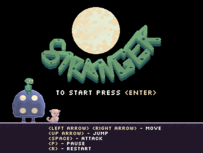
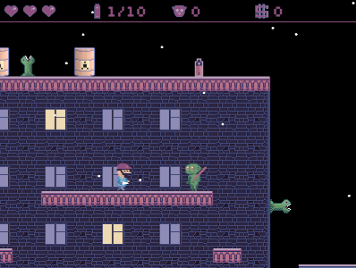

# Stranger

This is a platformer game about an eccentric alien.

An alien, wandering the galaxy in search of various cat species, finds himself in a tough situation.
His small spaceship is forced to land due to a power shortage on planet Earth, in a troubled neighborhood of a city.

The streets are in chaos! Lawlessness reigns, gang members roam everywhere, and the environment is in terrible condition.  
Due to worsening ecology, mutants have emerged, driven only by destruction and harm.

The alien has visited this planet before and understands the danger, but his mission must be completed.
Armed with a bat, he ventures into the dangerous streets to collect cat samples and, most importantly,
find batteries to repair his ship and escape this perilous planet as soon as possible.

## ScreeShots

Main screen

Gameplay

## Game idea

Sometimes, I scribbled game ideas in my notebook, and platformers were no exception.

Inspired by thoughts on extraterrestrial life, I created a game about an alien’s adventure on Earth. Using Kaplay.js and Aseprite, MilkyTracker and ZzFXM, Tiled. I started with the drawing graphics and then moved on to coding.

Driven by enthusiasm, this game came to life 🖤

## Development

If you want to run this game on your machine, modify it, or fix something, follow these steps:

1.  Clone this repository to your local machine.
2.  Navigate to the project folder and open a terminal.
3.  Run command: `npm install`
4.  Run the following command to start the development server: `npm run dev`

Now you can begin working on the project.

To build the game for distribution:

1. Ensure all changes are committed.
2. Open the terminal and run: `npm run build`

This will create the build version of the game, which will be located in the dist folder.
You can find the fully packaged game there, ready for distribution.
